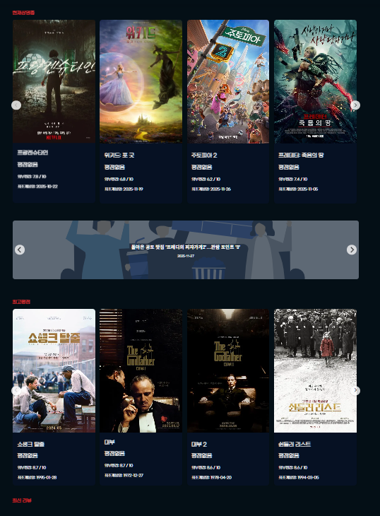
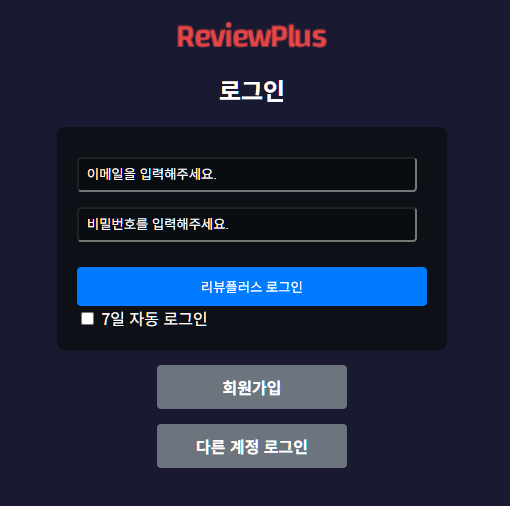
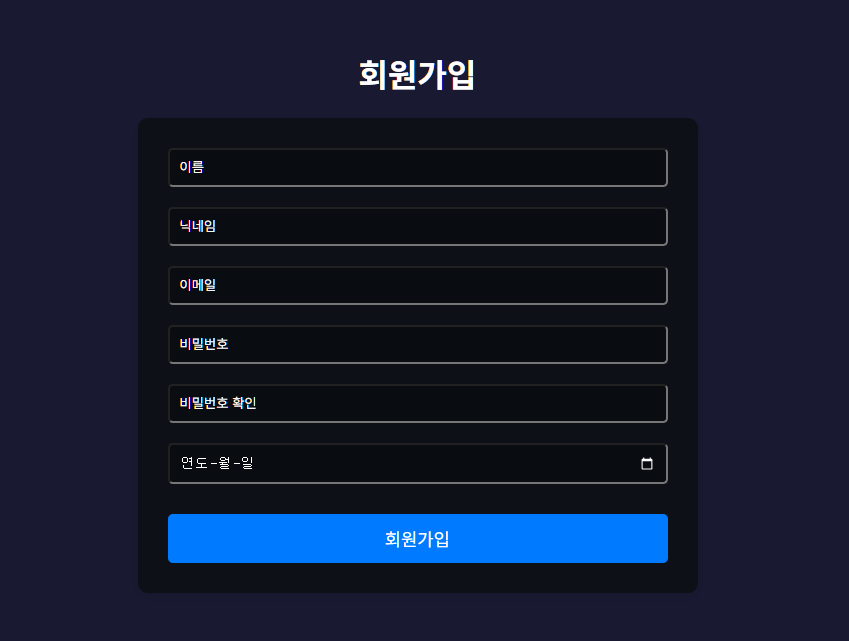
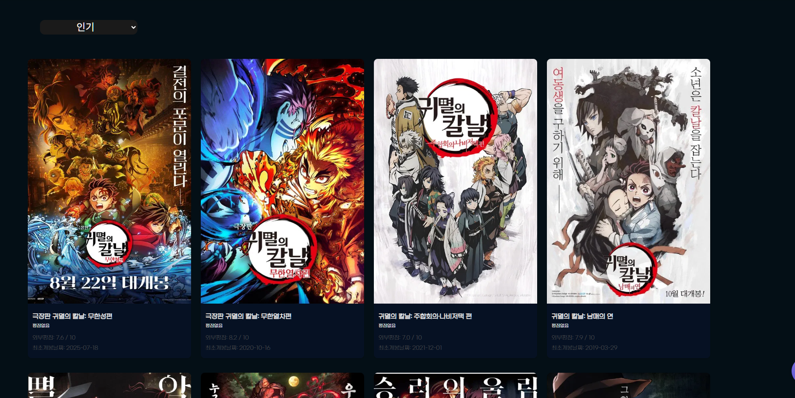
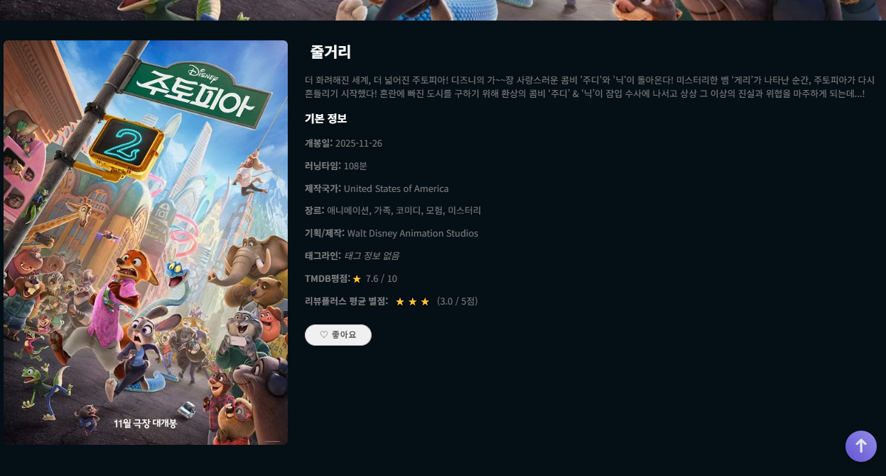
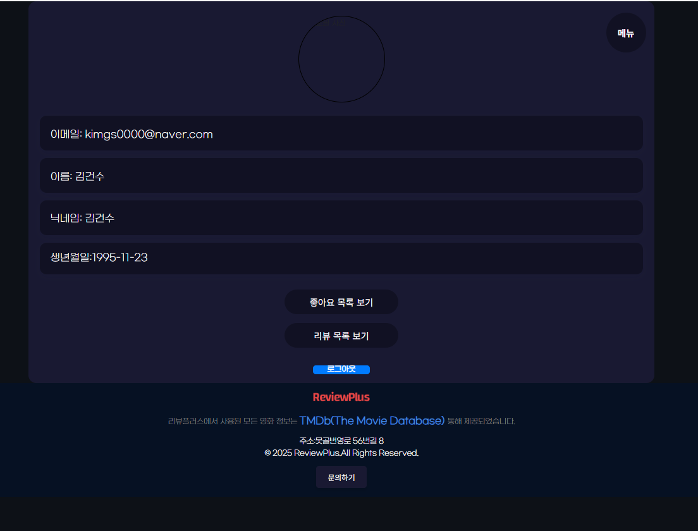
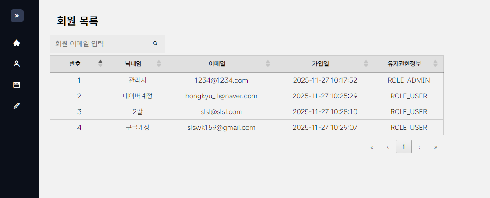
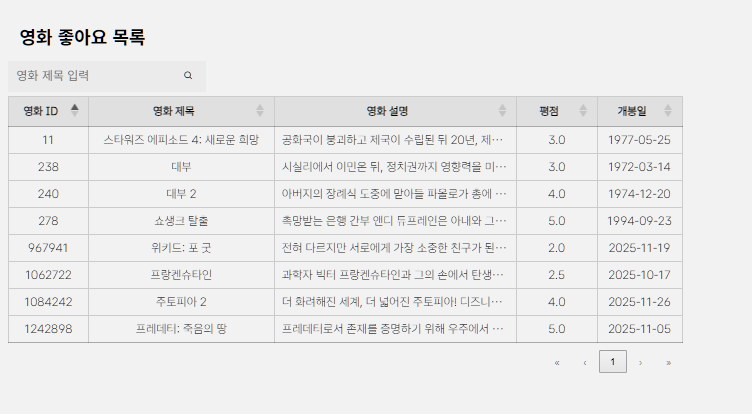
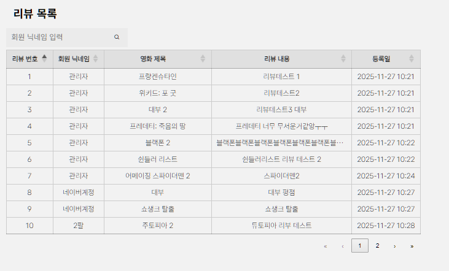

## 🎬 리뷰플러스 v2.0

스프링 부트(JPA, Gradle) 기반 영화 리뷰 서비스인 **리뷰플러스**의 **업그레이드 버전**

🌐 **[서비스 바로가기 →](https://reivewplus-final.onrender.com)**
> ⚠️ 배포 환경 특성상 첫 접속 시 서버가 시작되기까지 약 3~5분 정도 소요될 수 있습니다.

## 📚 프로젝트 소개
- **📆 프로젝트 기간 : 2025.10.27 ~ 2025.11.28**
- **팀 구성**: 조홍규(팀장), 김태경, 김근수, 강기민, 전재율
- **나(김근수)의 기여**:
  - 홈 화면 디자인 수정
  - 회원 정보 조회 및 변경 기능 수정
  - 회원가입 기능 구현
  - 회원 탈퇴 기능 구현
  - 홈 화면 매거진 기능 추가
  - 뉴스 API 연동
  - 서비스 배포

## 🛠 기술 스택
### IDE

### 언어

### 프레임워크

### 라이브러리

### DB

### OS

### 인증

### 빌드 툴

### 배포 툴

### 협업 툴

---

## 💻 화면 구성
### 🎬 메인

### 🔑 로그인 / 회원가입
| 로그인 | 회원가입 |
|--------|-----------|
|  |  |

### 🎬 영화 검색 / 영화 상세
| 검색 | 상세 |
|------|------|
|  |  |

### 👤 회원 정보

| 회원 정보 조회 | 회원 정보 변경 |
|----------------|----------------|
|  |  |

### 🛠 관리자 페이지
| 회원 관리 | 영화 관리 | 리뷰 관리 |
|------------|------------|------------|
|  |  | 

